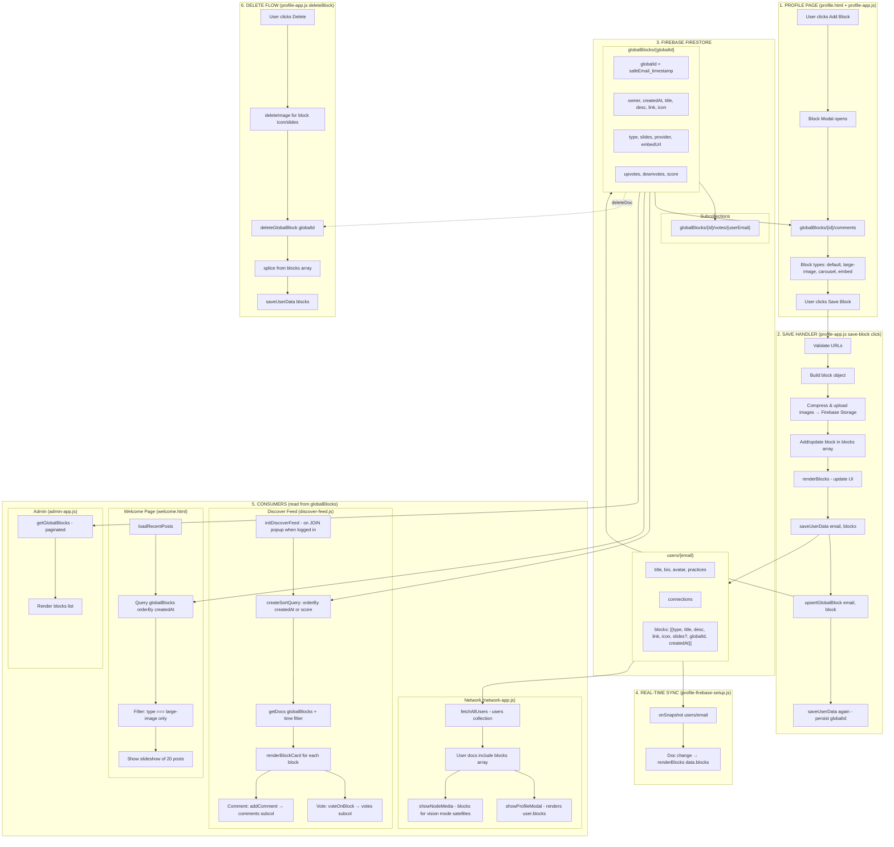

# Profile Posts → Global Blocks → Discover Feed: System Flow Diagram

This document maps how content flows from a user's profile post to global blocks and into the Discover feed.

---

## High-Level Flow

```
┌─────────────────┐     ┌──────────────────┐     ┌─────────────────────┐
│  PROFILE PAGE   │────▶│  FIREBASE STORE   │────▶│  DISCOVER / FEEDS    │
│  (profile.html) │     │  (dual write)     │     │  (read from global)  │
└─────────────────┘     └──────────────────┘     └─────────────────────┘
```

---

## Detailed System Diagram



---

## Data Flow Summary

| Step | Action | Location | Firebase |
|------|--------|----------|----------|
| 1 | User creates block on profile | profile.html | — |
| 2 | Images uploaded | profile-app.js | Storage: `blocks/{email}/...` |
| 3 | Block saved to user doc | profile-firebase-setup.js | `users/{email}` → `blocks` array |
| 4 | Block upserted to global | profile-firebase-setup.js | `globalBlocks/{globalId}` |
| 5 | Real-time listener updates UI | profile-firebase-setup.js | onSnapshot `users/{email}` |
| 6 | Discover feed queries | discover-feed.js | `globalBlocks` collection |
| 7 | Welcome slideshow queries | welcome.html | `globalBlocks` (large-image only) |
| 8 | Network profile modal | network-app.js | `users` (includes blocks) |
| 9 | Delete block | profile-app.js | Delete from both `users.blocks` and `globalBlocks` |

---

## Key Functions

| Function | File | Purpose |
|----------|------|---------|
| `saveUserData(email, { blocks })` | profile-firebase-setup.js | Merge blocks into users doc |
| `upsertGlobalBlock(ownerEmail, block)` | profile-firebase-setup.js | Create/update globalBlocks doc |
| `generateGlobalBlockId(email, createdAt)` | profile-firebase-setup.js | `safeEmail_timestamp` |
| `deleteGlobalBlock(globalId)` | profile-firebase-setup.js | Remove from globalBlocks |
| `setupUserDataListener(email)` | profile-firebase-setup.js | Real-time sync for profile |
| `createSortQuery(sort, timeFilter)` | discover-feed.js | Query globalBlocks (newest/votes) |
| `renderBlockCard(block, container)` | discover-feed.js | Render block in Discover |
| `voteOnBlock(blockId, value)` | discover-feed.js | Up/down vote |
| `addComment(blockId, text)` | discover-feed.js | Add comment |
| `fetchAllUsers()` | network-firebase-setup.js | Get all users (with blocks) |

---

## Block Types

| Type | Profile display | Discover display | Welcome slideshow |
|------|-----------------|------------------|-------------------|
| `default` | Icon + text | Icon + text | No |
| `large-image` | Large image + text | Large image + text | **Yes** |
| `carousel` | Multi-slide | Carousel | No |
| `embed` | YouTube/Spotify iframe | YouTube/Spotify iframe | No |

---

## Firebase Collections Structure

```
users/
  {email}/
    id, title, bio, avatar, practices, connections, ...
    blocks: [
      { type, title, desc, link, icon, slides?, globalId, createdAt }
    ]

globalBlocks/
  {globalId}/   ← globalId = safeEmail_timestamp
    owner, createdAt, title, desc, link, icon, type, slides
    provider?, embedUrl?   (for embeds)
    upvotes, downvotes, score
    votes/{userEmail}      (subcollection)
    comments/              (subcollection)
```
